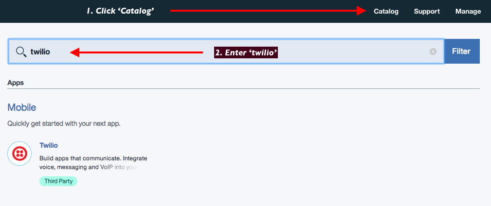

---

copyright:

  years:  2017

lastupdated: "2017-07-26"

---

{:new_window: target="_blank"}
{:shortdesc: .shortdesc}
{:screen:.screen}
{:codeblock:.codeblock}
{:pre: .pre}

# Getting started with Twilio Programmable SMS
{: #gettingstarted_TwilioProgrammableSMS}

Twilio’s [Programmable SMS](https://www.twilio.com/sms) makes it simple to add
SMS and MMS applications to your web application. With Twilio’s cloud
communications power plus the serverless capabilities of IBM’s Bluemix, you’ve
got an unbeatable team.
{: shortdesc}

## About

We’re going to build a serverless application using Cloud Foundry Apps and the
Twilio Service on Bluemix to both send outgoing text messages and to respond
to incoming text messages. We’re going to be basing it heavily on our own
[Node.js SMS Quickstart](https://www.twilio.com/docs/quickstart/node/programmable-sms),
with some adaptations for the IBM cloud. 

## Setting the project

Follow this steps to get started with Twilio Programmable SMS on Bluemix:

1. Sign into the [Twilio Console](https://www.twilio.com/console){: new_window}
   or [Register](https://www.twilio.com/try-twilio){: new_window} for a Free
   Account

2. If necessary, download and install the [Bluemix Command Line Interface](https://console.bluemix.net/docs/starters/install_cli.html){: new_window}
   - Change the API Endpoint and Login:

     ```
     bluemix api https://api.ng.bluemix.net
     bluemix login
     ```
     {: codeblock}

3. Log into Bluemix Console and create a Twilio App

   - Click 'Catalog' at the top of the screen
   - Enter 'twilio'

   

4. In the ensuing screen, enter your `Account SID` and `Auth Token` from the
   Twilio Console. In the Twilio Console, your credentials can be found here:

   

   Once complete (and correct), 'Create' the App.

5. In the Bluemix Console, select 'Catalog' -> 'Apps' -> 'Cloud Foundry Apps'
   then select the `SDK for Node.js`. Name it something memorable.

6. In the Bluemix Dashboard, click on your Twilio Service under 'Services',
   then click the 'Create connection +' button. Connect it to your new Node.js
   App.

7. Set two environment variables:

   ```
   TWILIO_PHONE_NUMBER
   TWILIO_OUTGOING_PHONE_NUMBER
   ```
   {: screen}

   The first should be a Twilio controlled phone number you’ve purchased
   (with SMS capabilities). The second should be a cell phone number where
   you can receive texts.

8. Locally, clone our sample application:

   ```
   git clone https://github.com/TwilioDevEd/twilio-bluemix-sms-quickstart.git
   ```
   {: pre}

9. Deploy the application using the command line tools:

   ```
   bluemix app push <Your App Name>
   ```
   {: pre}

10. In the Twilio console, you need to add a Webhook for the 'receive-sms'
    route.

    

    It can be found here in the Bluemix console.

    

11. In the browser, visit `<your Bluemix URL>/send-sms`. You’ll get a
    controversial statement in response. Make sure you reply with your best
    argument.

12. To complete the loop, you should receive a well-argued retort.

And with that you’ve got the bones of a SMS sending and receiving application.

Want to take it further? You’ve now got the Twilio Node.js SDK installed, so
you can build out in any direction. Find all of our Node.js communications
application tutorials on our Documentation site.

We can’t wait to see what you build!
